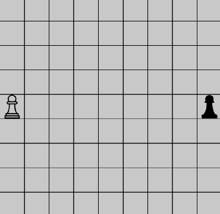
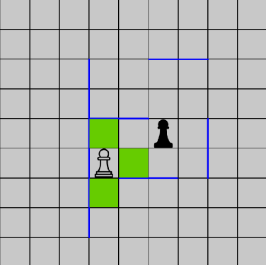

# Quoridor

Quoridor est un jeu de plateau stratégique aux règles simples.
Nous proposons une implémentation du jeu entièrement basée en c++ dans le cadre du projet LIFAPCD
On peut décomposer le projet en une partie Base et une partie UI

# Règles du jeu Quoridor
Les règles les suivantes :
- Le jeu se passe sur un board carré de 9x9 cases
- Chaque joueur incarne un Pion qui sont initialement placés face à face au centre de 2 lignes opposées
- Tour à tour un joueur peut décider soit de déplacer son Pion sur une case adjacente innoccupée du board ou bien de placer un Mur de deux cases de longueur
    bloquant le déplacement d'un joueur d'une case vers une autre
- Evidemment deux Murs ne peuvent pas se chavaucher, un Mur ne peut jamais "sortir" d'un côté ou de l'autre du board
    et enfin un Mur ne peut pas empêcher un joueur de gagner la partie
- La partie est gagné par l'un des joueur lorsque celui-ci arrive sur l'une des cases du côté opposé par rapport à celui dont il est partit
- Un joueur peut cependant "enjamber" un autre joueur adjacent sauf si on mur l'en empêche
 

# Comment Jouer au Clavier/Souris sur le plateau

Click gauche : Afficher les cases disponibles pour se déplacer puis sélectionner avec click gauche encore

touche m : Met un mur sur votre curseur qui est posable avec click droit, ou touche m encorem pour annuler la pose du mur

touche s : changer l'orientation vertical/horizontal dur mur qu'on veut poser

touche t : faire apparaître le menu

# Auteur
Julien P12025052

# Répertoire de l'archive

    Quoridor/
        -Quoridor.sln : Projet vs2019 pour compiler le code

        Quoridor/data : stock les différentes iamges utilisées dans le projet

        Quoridor/Doc : Documentation doxygen + diagramme de classe

        Quoridor/src : dossier contenant tous les .cpp/.h
            -App : Classe application window mise en place avec wxWidgets et uilisant la classe Partie
            -MainFrame : Objet héritée de wxwin qui contient tous les widgets (UI)
        
        Quoridor/src/base : Base isolée pour le jeu du Quoridor
            -TableauDynamiqueMur : Classe gèrant les objets Murs que les joueurs posent au cours d'une partie
            -MatricesCases : (déprécié) Classe représentant le board avec un tableau 2D
            -Partie : Classe qui réalise le jeu en tant que tel en jouant des coups, maj des joueurs, gestion du tableau des murs etc
            -vec2.h : Classe de Chan Jer Shyan omniprésente dans le code qui propose une classe pour les couples(x,y) -> vec2<int>
            -TestNonRegression.cpp : assert du pleins de cas différents d'une partie pour le debug

# Remerciements

Alexandre Mayer

Chan Jer Shyan pour sa classe vec2 libre d'utilisation
